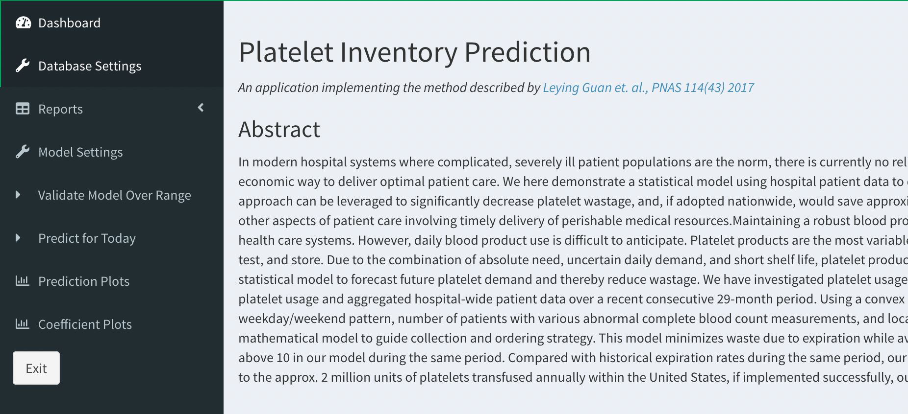
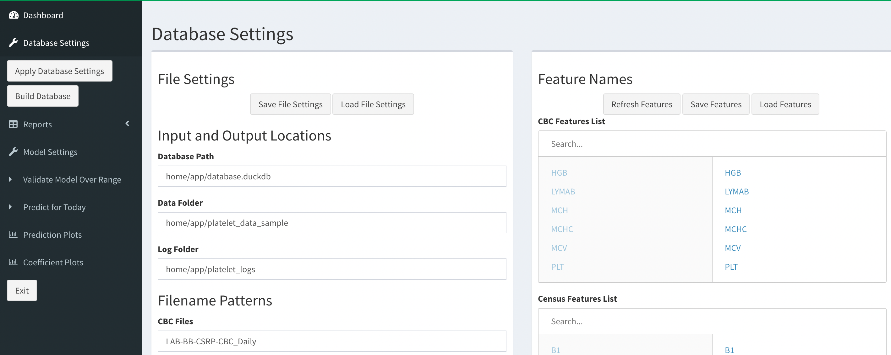
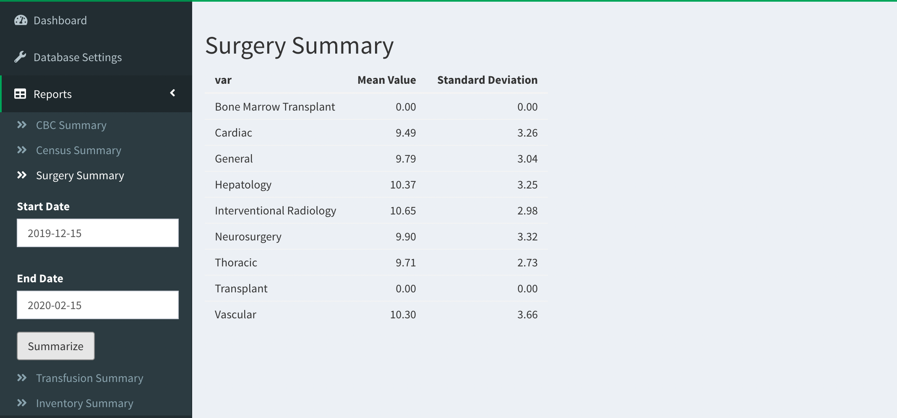
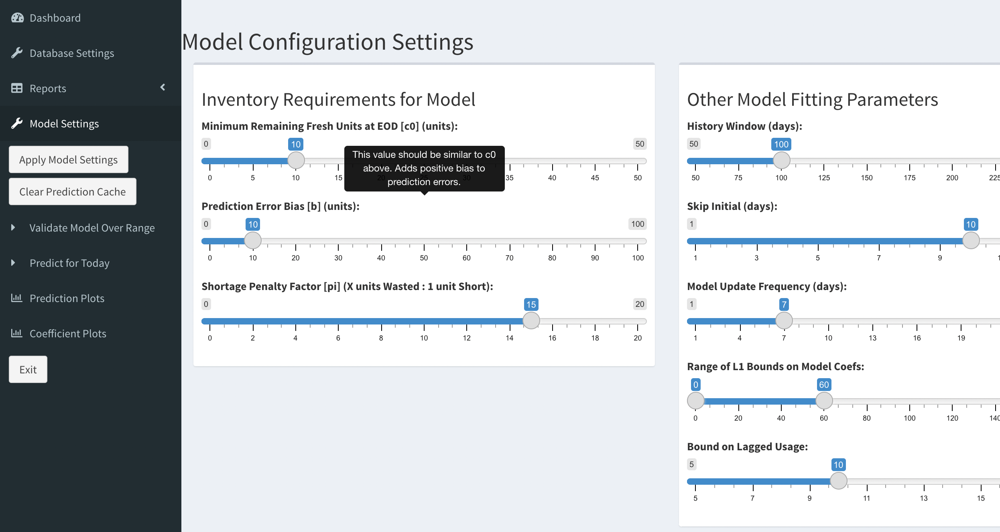
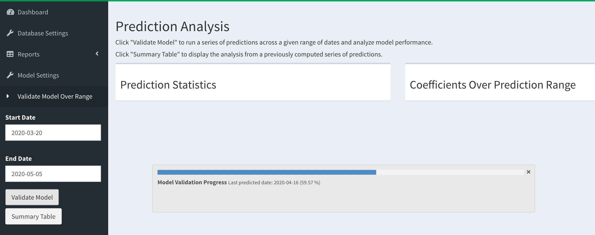
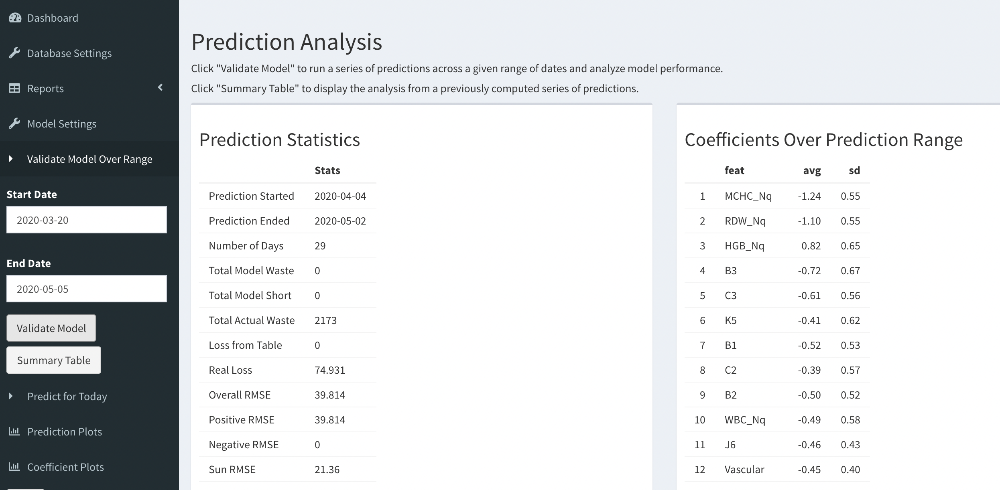
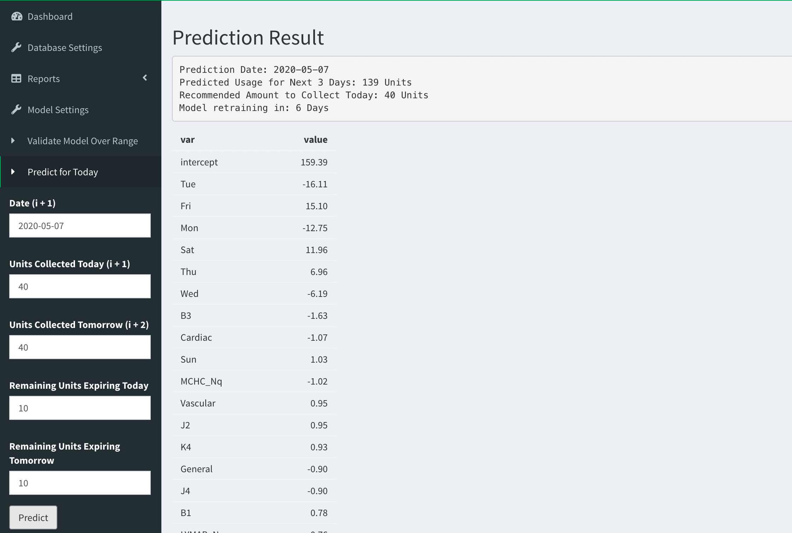
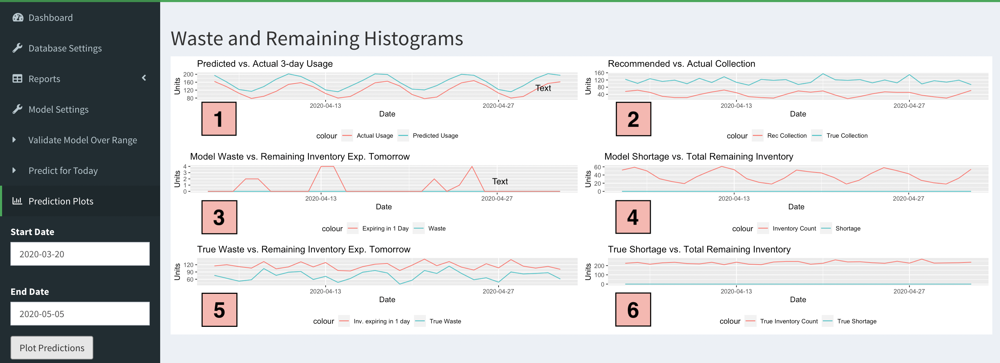
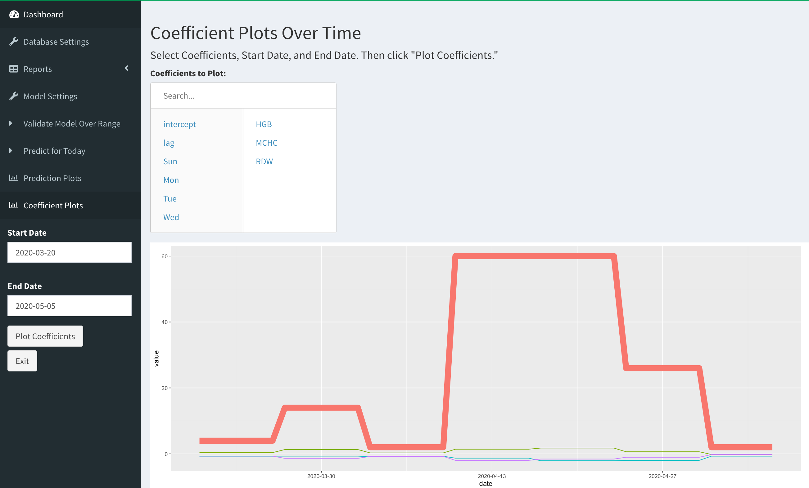

<style>
<style type="text/css">
h1 { /* Header 1 */
  font-size: 28px;
  color: DarkBlue;
}
h2 { /* Header 2 */
  font-size: 22px;
  color: DarkBlue;
}
h3 { /* Header 3 */
  font-size: 18px;
  color: DarkBlue;
</style>

# Introduction

At a high level, the `SBCpip` package provides an interface to a model that predicts blood platelet
usage based on hospital data over time. It also recommends the number of units that should be 
collected to satisfy future usage. The model itself is specified in the `pip` package, and it relies 
on time-series prediction using a linear program, based on original work by @Guan11368.

We anticipate that most users of this package will be practitioners at hospitals and blood centers 
rather than R developers, so this vignette is concerned with preparing data and setting up the dashboard 
to make predictions. This package provides toy data for users to practice using the dashboard functionality. However,
in order to make true predictions using site-specific data, users must first follow the steps outlined [here](SOP_data.html) to ensure data compatibility. 

A fuller technical treatment of the package is given in [this vignette](SOP_dev.html).

# Quick Start

To get started, enter the following commands in the R console (via terminal command line or in RStudio) :

```{r, eval=FALSE}
install.packages("devtools")
library(devtools)

devtools::install_github(repo = "https://github.com/okadak126/pip")
devtools::install_github(repo = "https://github.com/okadak126/SBCpip")
library(pip)
library(SBCpip)
```


To explore the Prediction Dashboard before preparing actual site-specific data, users can run the following commands to set up a sample data folder (called `platelet_data_sample`):
```{r, eval=FALSE}
sample_data <- system.file(package = "SBCpip", "extdata", "platelet_data_sample.zip")
unzip(sample_data, exdir = "mydirectory") 
# User should adjust the exdir path based on their system. The data folder is "mydirectory/platelet_data_sample"
```

At this point, users can launch the dashboard by running:
```{r, eval=FALSE}
sbc_dashboard()
```

Note that additional packages may need to be installed at this point to run the dashboard. Run `install.packages("package")` according to these requirements.

With the data directory just generated, users can move directly to the **Running the Dashboard** section below. Please note that the provided sample data include synthetic data from each of the required file types from November 30, 2019, through May 10, 2020. The format of each of these sample files is based on files originally obtained from the Stanford Blood Center. The section below explains each of the required file types in greater detail. 

# Data Overview
`SBCpip` relies on 5 different file types. "CBC", "Census", and "Surgery" are included as covariates/features in fitting the predictive model, and "Transfusion" contains information about blood product usage Each of the below file types must be added to the same data folder for each date used in making the prediction:

1. **CBC:** Results of Complete Blood Count (CBC) tests on hospital patients on a given date. The goal is to identify abnormal levels in hospital patients and use these instances as inputs to the model [1 row = 1 unique measurement].
2. **Census:** Locations of patients in the hospital system (e.g. rooms, wards) on a given date. The goal is to identify specific locations that are increasing hospital demand for specific blood products [1 row = 1 unique patient].
3. **Surgery:** Surgeries carried out by hospital on a given date (or scheduled to be performed in the next 3 days). The goal is to identify particular surgery types that are increasing hospital demand for specific blood products [1 row = 1 unique operation].
4. **Transfusion:** Transfusions that occur at the hospital on a given date. This is the response which we try to predict (transfusions over next 2 or 3 days) [1 row = 1 unique transfusion of a blood product].
5. **Inventory:** Blood products collected and available in inventory for issue to hospital / transfusions. We use this to compare model performance to actual historical protocol [1 row = 1 unit]. Note that inventory files should be in .xlsx format.

In order to prepare site-specific data for use with the dashboard, please refer to [this vignette](SOP_data.html).

# Running the Dashboard

<!--  -->

The Shiny Dashboard interface provides a greatly simplified way to accomplish model training and prediction
tasks. It is launched by running the following command:

```{r, eval = FALSE}
library(SBCpip)
sbc_dashboard()
```

The Dashboard consists of the following seven tabs, arranged in order of their 
expected usage for prediction tasks:

## Database Settings

This panel allows the user to specify the files, folders, and relevant features to 
construct the database that will be used in model training and prediction.

{width=70%}

#### Instructions:

1. Specify the local paths to the database, the data folder, and the log folder, as well as filename prefixes for each type of data file under "Filename Patterns". Then click **Save File Settings**. If you have already done this in a previous session, click **Load File Settings**. 

2. Click **Refresh Features** to pull in a complete list of features from each file type in the provided data folder. Use the picklists to select features believed to be the most relevant. Then click **Save Features**. If you have already done this in a previous session, click **Load Features**.

3. Click **Apply Database Settings** and then **Build Database** on the lefthand panel. This operation will take several minutes to complete. It builds a database based on every data file in the specified data folder.

#### Tips:

- To determine appropriate paths for the Input and Output Locations, run the following `setwd("~");getwd()` in the R console. This will return the home directory (e.g. `/Users/myname`). Then append to this appropriate subfolders such as `/Desktop/mydata`.

- The DuckDB file need not exist - the program will create it when the database is built.

- Filename prefixes for each file type should immediately precede the date for the particular file. For example, if the prefix for a Census file is `Hospital_Census_Data`, the name of the Census file obtained on March 10, 2020, should begin `Hospital_Census_Data2020-03-10`

- Again, to experiment with synthetic sample data, run the following in R:
```{r, eval=FALSE}
sample_data <- system.file(package = "SBCpip", "extdata", "platelet_data_sample.zip")
unzip(sample_data, exdir = "mydirectory")
# User should adjust the exdir path based on their system. The data folder is "mydirectory/platelet_data_sample"
```

---------

## Reports 

Reports are primarily for querying and sanity-checking the built database. Provide a range of dates
(or a single date) to analyze and click **Summarize**. This displays the mean and standard deviations of
each of the features over the date range.

{width=70%}

---------

## Model Settings
The user sets model training parameters such as the  (positive) prediction bias, number of previous days used in training window, and hyperparameter values. The dashboard provides some additional intuition regarding the effects of modifying each of these parameters.

{width=70%}

#### Instructions

1. Modify Model Parameters as needed based on the results of model validation. Hovering over each parameter name will display additional information about the impact of adjusting the parameter on model predictions. For a more mathematical treatment of the model parameters, please refer to **Model Description and Behavior** [here](SOP_dev.html).

2. Click **Apply Model Settings**.

3. If you would like to clear previous predictions to run a new set of predictions over the same dates, click **Clear Prediction Cache**.

---------


## Validate Model Over Range
The user can run predictions over a specified range of dates and compare the usage predictions and waste generate against "true" values of usage and waste according to the historical protocol. 

{width=70%}

#### Instructions:

1. Supply the start and end dates for a date range over which to validate the model settings. Then click **Validate Model**. Note that it is important to understand the range of dates available in the data folder/database. For the given sample data and a training history window of 100 days, Start Date = `2020-03-20` and End Date = `2020-05-05` are appropriate. 

2. If you have already run the validation above in a previous session, the predictions should be cached in the database, so click **Summary Table** over the same range of dates.

The result displays a summary of prediction error, waste, shortage, and nonzero coefficients in the model.

{width=70%}

#### Tips:
- Depending on the length of the prediction date range and certain **Model Settings** parameters, the validation can take up to 20-30 minutes to complete. A progress bar is provided as shown above.

- In this toy example, the model drastically outperforms the true (randomized) protocol based on the Inventory Files. In addition to comparing the Model's Waste and Shortage with those under the true protocol, the RMSE figures break down the model's raw prediction error by its positive and negative components, as well as by day of week. In this case, the error is positively biased, which we expect based on the bias parameters specified in **Model Settings**.

- The right-hand panel displays coefficients with particularly large magnitudes over the course of the validation period (excluding the day of week). This is used to compare importance of specific features driving platelet usage with intuition.

- Note that the provided "Start Date" and "End Date" do not match the "Prediction Started" and "Prediction Ended" dates. Recall that the `start` parameter sets a delay between we start running the model for evaluation and when we begin to assess Waste, Shortage, etc. Also note that the validation must end 3 days prior to the specified "End Date" because we compare model predictions against platelet usage for the next 3 days.

---------


## Predict for Today
With a validated model, this mode assumes the user would like to run a prediction of 
expected platelet usage over the next 3 days (including today) without necessarily 
being able to validate against ground truth transfusions.

{width=70%}

#### Suggested Process

Suppose it is currently the morning of May 7, 2020, as shown above. This mode makes the assumption that 

- Hospital data from May 6 (day $i$) is available early on May 7 (day $i + 1$).
- Platelet units should be collected *2 days in advance* of when they can be made available to patients. That is,
the user would like to predict total transfusions from May 7-9 in order to obtain a recommended amount
to collect today.
- Collections for May 7 and May 8 are already fixed (at 40 units for both days).


#### Instructions:
1. Add new data files to the Data Folder from the previous day $i$ (5 files in total - see **Data Overview**). Each file must include date $i + 1$ (the current day) in the name. In the example above, all 5 filenames should contain `2020-05-07`
2. Input this same date in the `Date (i + 1)` field.
3. Input the number of fresh platelets that will be collected today and tomorrow. 
4. Input the number of remaining inventory platelets expiring at the end of the day today as well as tomorrow.
5. Check that the database includes data from the start of the training history window until day $i - 1$ (e.g. using **Reports**), then click **Predict**.
 
#### Tips:

- When the user runs **Predict**, data from the new files for day $i$ will automatically be added to the database.

- The model may or may not need to retrain depending on the `model_update_freqency` specified in **Model Settings**. In either case, the model also outputs a list of non-zero valued feature coefficients by their absolute value.

---------


## Prediction Plots
This plots 6 line graphs for the specified date range, which can correspond to dates used for prediction in either **Validate Model Over Range** or **Predict for Today**.



#### Summary of Plots

1. Predicted vs. actual next-three-day usage for each day (note consistent positive bias to avoid shortage)
2. Collection recommendations over time for each day vs. true collections (note that true collection far exceeds recommendation)
3. Model's generated waste vs. number of platelets remaining in inventory that 
expire the following day (this is a waste precursor)
4. True waste vs. number of platelets remaining in inventory that 
expire the following day (based on policy carried out in practice)
5. Model's shortage vs. number of total platelets remaining in inventory
6. True shortage vs. number of platelets remaining in inventory that expire
in 2 days (based on policy carried out in practice)

---------

## Coefficient Plots
For a given range of dates with predictions, the user can select features from a picklist, and the dashboard will plot the evolution of their coefficients (roughly, a measure of their importance in the model's predictions) over time.
They are plotted against `Coefficient L1 Bound` (thick red line), which is the constraint on the absolute value of the sum
of the coefficients (this ensures a sparse model by L1 regularization). 

We note from **Validate Model Over Range** that `HGB`, `MCHC`, and `RDW` are prominent covariates - therefore we may be interested in plotting them over time (the same validation date range). This is shown below:

{width=70%}

Based on the plot above, it is clear that none of the three selected covariates comprises a significant proportion of the total possible signal (given by the thick red line).

# References


